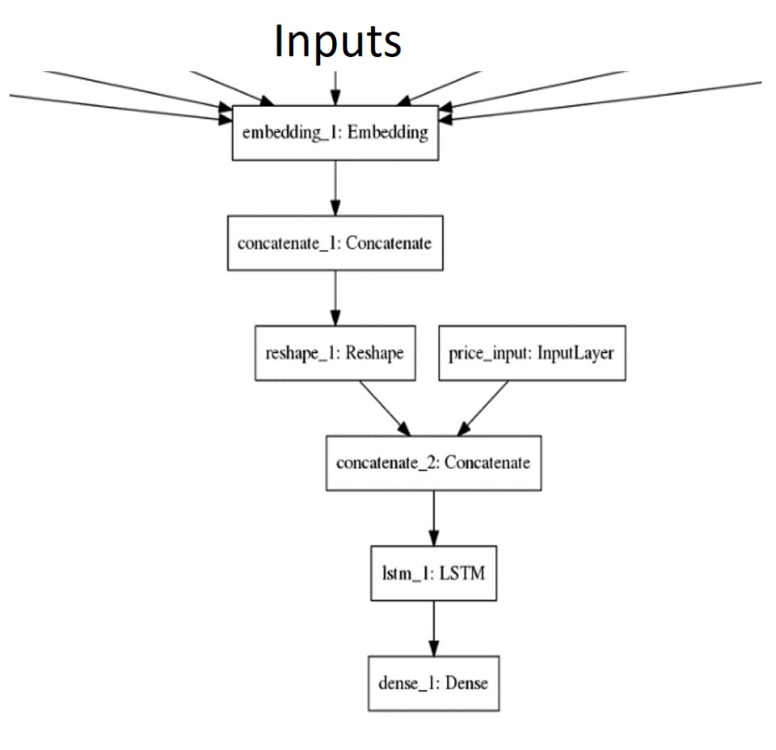

# Stock Price Prediction Using Market Data and News
Can we actually predict stock prices with machine learning? Investors make educated guesses by analyzing data. They'll read the news, study the company history, industry trends and other lots of data points that go into making a prediction. The prevailing theories is that stock prices are totally random and unpredictable but that raises the question why top firms like Morgan Stanley and Citigroup hire quantitative analysts to build predictive models.

This project utilizes Deep Learning models, Long-Short Term Memory (LSTM) Neural Network algorithm, to predict stock prices. For data with timeframes recurrent neural networks (RNNs) come in handy but recent researches have shown that LSTM networks are the most popular and useful variants of RNNs.
We have used Keras to build a LSTM to predict stock prices using historical stock prices and news data and visualize both the predicted price values over time and the optimal parameters for the model.

# Input Dataset 
* World News Headlines &
* Price history data of some companies

# Model architechture

# Output 
The closing price of each company for a day

# Performance matrix
For a company, we are going to measure
            `error=  (predicted price-actual price) / actual price`

as our performance metric.
We then compute the average of all such errors for each company as our combined performance metric.

# Result

For more detailed description, please check the reports in result folder.

# Team members
* Data Collector: 13050117
* Coder: 1305063
* Trainer:  1305010 (me)
* Writer: 1305011
* Leader: 1305061
